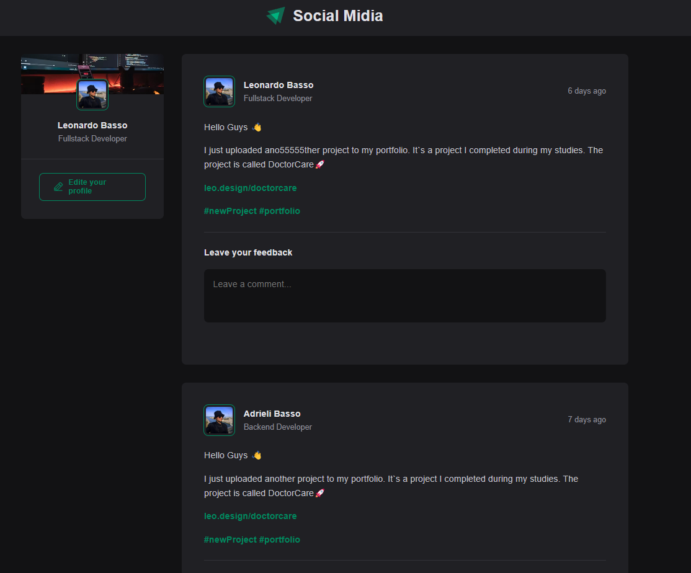

Social Media App

📌 Description

IT's a social media feed application built using React. This project was developed to explore and apply key concepts of modern React development while creating an interactive and engaging social experience.

🚀 Features

✅ Create Posts – Users can add new posts to the feed.

✅ Comment on Posts – Engage with content by leaving comments.

✅ Like (Applaud) Comments – Show appreciation for comments with a like system.

✅ Delete Posts – Users can remove posts from the feed.

✅ Responsive UI – Ensuring a smooth and intuitive user experience across devices.

🛠️ Technologies Used

React – Library for building the user interface.

TypeScript – Adding static typing for better maintainability.

CSS Modules – Styling components with scoped CSS.

🎯 Key React Concepts Covered

Throughout this project, we explore:

Componentization – Breaking down the UI into reusable components.

Props & State – Managing data flow between components.

Hooks – Implementing useState and useEffect.

Immutability – Updating state predictably.

Rendering & Performance Optimization – Ensuring efficient UI updates.

🏗️ How to Run the Project

Clone this repository:
```bash
git clone https://github.com/LeeonarD0/Social-Midia-REACTJS.git
```
Navigate to the project folder:

Install dependencies:

```bash
npm install
```

Start the development server:

```bash
npm run dev
```
Open your browser and go to http://localhost:5173



